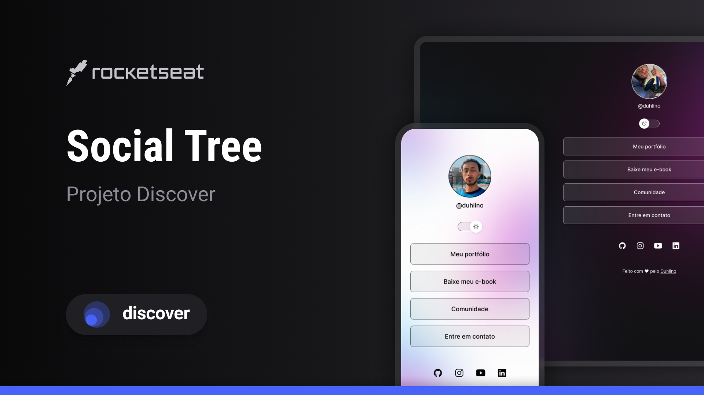

<h1 align="center"> Social Tree </h1>

Evento exclusivo e gratuito, promovido pela Rocketseat para ensino de tecnologias WEB.

  <a href="#-tecnologias">Tecnologias</a>&nbsp;&nbsp;&nbsp;|&nbsp;&nbsp;&nbsp;
  <a href="#-projeto">Projeto</a>&nbsp;&nbsp;&nbsp;|&nbsp;&nbsp;&nbsp;
  <a href="#-layout">Layout</a>&nbsp;&nbsp;&nbsp;|&nbsp;&nbsp;&nbsp;
  <a href="#memo-licença">Licença</a>

  

 

  

## 🚀 Tecnologias

Esse projeto foi desenvolvido com as seguintes tecnologias:

- HTML e CSS
- JavaScript
- Git e Github
- Figma

## 💻 Projeto

O Social Tree é um agregador de links para usar como cartão de visitas online.

## 🔖 Layout

Você pode visualizar o layout do projeto através [DESSE LINK](<https://www.figma.com/design/XSkajGzLShPcXT9zXKuXEo/DevLinks-%E2%80%A2-Projeto-Discover-(Community)?node-id=10-620&t=PCSBVzxM1tM7JLfu-0>) para acessá-lo.

## 🏆 Licença

Esse projeto está sob a licença MIT.

---

Feito com ❤ by Duhlino 🌊 [Participe da minha comunidade!](https://discord.com/invite/arKyWWa83U)
